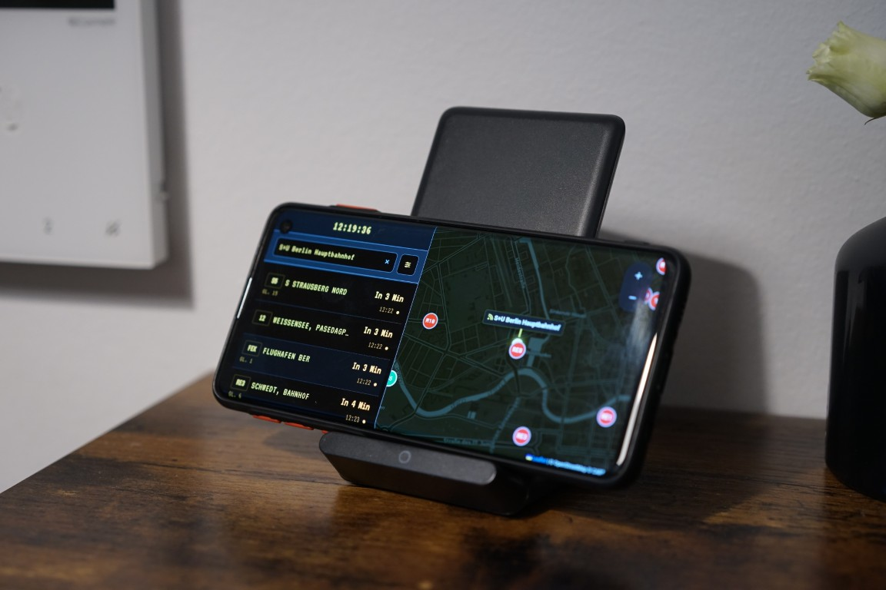
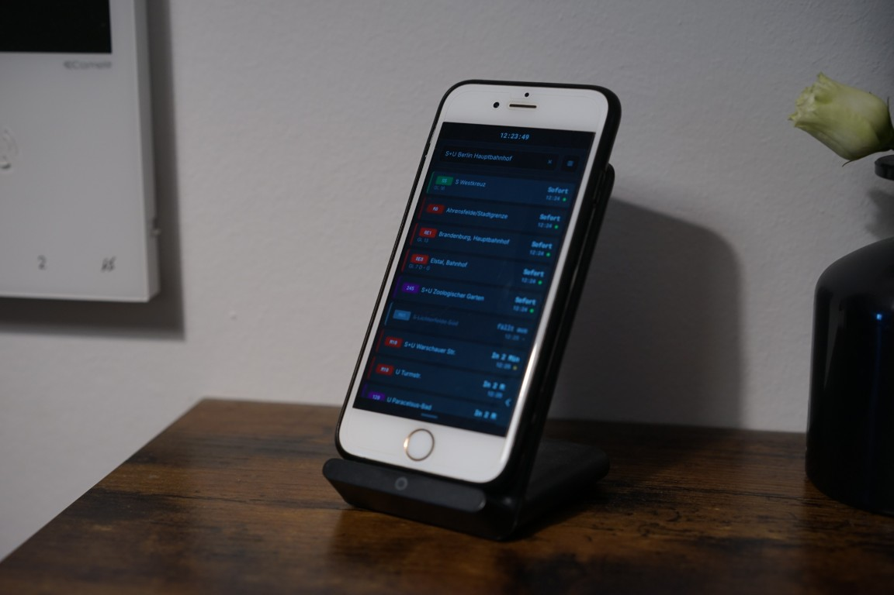

# Berlin Transit Live Monitor

A modern, responsive web dashboard designed for real-time monitoring of public transport departures in Berlin. This tool provides a comprehensive view of transit movements, combining temporal schedules with spatial tracking.

### ♻️ Theme: Repurposing Old Phones into Schedule Displays
**Don't let your old smartphones collect dust!** This project was specifically designed and optimized to turn any spare smartphone or tablet into a dedicated, real-time smart transit monitor. By opening this dashboard in full-screen on an old device, you can create a permanent public transport timetable for your home, hallway, or office. 

<table align="center" style="border: none; background: none;">
  <tr style="border: none; background: none;">
    <td align="center" width="50%" style="border: none;">
      
       
      <i>1. Old Android phone displaying the timetable and real-time map (via the <b>Fully Kiosk Browser</b> app).</i>
    </td>
    <td align="center" width="50%" style="border: none;">
      
       
      <i>2. Old iPhone displaying the departure timetable (via the <b>Kiosker</b> app).</i>
    </td>
  </tr>
</table>

## Core Features

* Vehicle Type Filtering: Custom toggle filters for S-Bahn, U-Bahn, Tram, Bus, Regional trains and Fernzug.

* Live Status Indicators: Visual status dots (Green/Orange/Red/Grey) provide immediate feedback on punctuality and real-time adjustments.

* Interactive Timetables: Expandable departure cards allow users to view the upcoming stopovers and arrival times for any specific trip.

* Spatial Radar & Vehicle Tracking: Beyond text-based schedules, the dashboard maps and tracks incoming vehicles in real-time, providing a spatial representation of the transit network.

* Personalization: Support for starring favorite stations for quick access.

## Tech Stack

Frontend: Vue.js 3 (Composition API)

Mapping: Leaflet.js

Styling: Bootstrap 5 + Custom CSS (Light/Dark Mode supported)

Networking: Axios

## Data Source

All transit data is provided by the v6.bvg.transport.rest API. This project relies on the open-source community's efforts to wrap official public data into a developer-friendly format.

## Disclaimer

Data Validity: Real-time information is subject to the performance and availability of the underlying API.

Latency & Failures: The developer is not responsible for data inaccuracies caused by API latency, network downtime, or backend failures.

Non-Official: This is a third-party project and is not affiliated with, endorsed by, or connected to the Berliner Verkehrsbetriebe (BVG).

Developed for personal use and to demonstrate modern web-based GIS integration.
